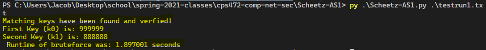
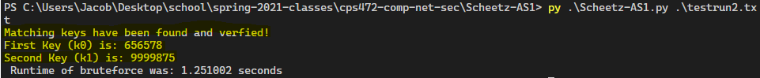

# Assignment 1 - TEA Bruteforce Attack in Python 3.9
## CPS - 472 Computer & Network Security
### Written By: Jacob Scheetz, Spring 2021

#### Description
- script that reads in 32 bit unsigned integer plaintext/ciphertext pairs to perform a bruteforce attack on 1 round of the TEA. By using a plaintext/ciphertext pair consisting of 32 bits a piece, we essentially reduce TEA's key space in half. By repeatedly guessing32 bits of the key, this script deduces the remaining 32 bits of the key left.

#### Program Usage:
```bash
py Scheetz-AS1.py -nameofsampledata
```

#### Sample output runs



